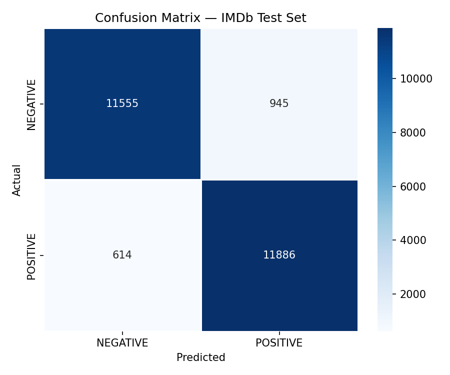
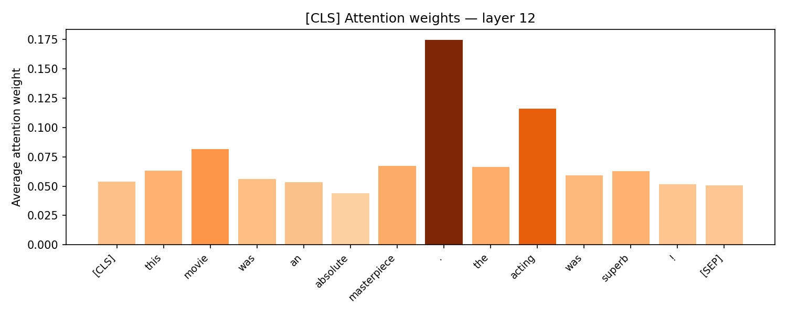

# 🎬 BERT Sentiment Analysis — IMDb Movie Reviews

A production-ready NLP project that fine-tunes **BERT (`bert-base-uncased`)** on the IMDb Movie Review dataset for **binary sentiment classification**.

The project includes:

* ✅ Fine-tuned transformer model
* ✅ Attention visualization
* ✅ Confusion matrix & training curves
* ✅ Streamlit web application
* ✅ HuggingFace hosted model
* ✅ Live deployment

---

# 🚀 Live Demo

### 🌐 Streamlit App

https://bert-sentiment-analysis-d6p2f8c7ir8ymccreqcdcw.streamlit.app/

---

# 🤗 HuggingFace Model

https://huggingface.co/Shreyu5835/bert-imdb-sentiment

---

# 📌 Features

* Fine-tuned `bert-base-uncased`
* Real-time sentiment prediction
* Attention weight visualization
* IMDb movie review classification
* Interactive Streamlit interface
* Confusion matrix & training curves
* HuggingFace model hosting
* GPU-compatible training pipeline

---

# 🧠 Model Overview

| Item       | Details                         |
| ---------- | ------------------------------- |
| Base Model | `bert-base-uncased`             |
| Task       | Binary Sentiment Classification |
| Dataset    | IMDb Movie Reviews              |
| Framework  | PyTorch + HuggingFace           |
| Accuracy   | 92%+                            |
| Classes    | POSITIVE / NEGATIVE             |

---

# 📂 Project Structure

```bash
bert_sentiment/
│
├── app.py                          # Streamlit web application
├── requirements.txt               # Python dependencies
├── README.md
├── training_notebook.ipynb        # Colab training notebook
│
├── outputs/
│   ├── training_curves.png
│   ├── confusion_matrix.png
│   └── attention_weights.png
│
├── src/
│   ├── config.py                  # Hyperparameters & paths
│   ├── data_loader.py             # Dataset loading + tokenization
│   ├── model.py                   # BERT classifier architecture
│   ├── train.py                   # Fine-tuning pipeline
│   ├── evaluate.py                # Metrics & visualization
│   └── inference.py               # Production inference pipeline
│
├── models/                        # Saved checkpoints (local)
└── data/                          # Dataset cache
```

---

# ⚡ Quick Start

## 1️⃣ Clone Repository

```bash
git clone https://github.com/ShreyaJadhav-3/BERT-sentiment-analysis.git

cd BERT-sentiment-analysis
```

---

## 2️⃣ Install Dependencies

```bash
pip install -r requirements.txt
```

---

## 3️⃣ Train Model

```bash
python src/train.py
```

---

## 4️⃣ Evaluate Model

```bash
python src/evaluate.py
```

This generates:

* confusion matrix
* attention visualization
* training curves

---

## 5️⃣ Run Streamlit App

```bash
python -m streamlit run app.py
```

---

# 📊 Results

| Metric    | Score |
| --------- | ----- |
| Accuracy  | 92%+  |
| Precision | ~0.92 |
| Recall    | ~0.92 |
| F1-Score  | ~0.92 |
| ROC-AUC   | ~0.97 |

---

# 📈 Training Curves


---

# 🔥 Confusion Matrix



---

# 👀 Attention Visualization

The model visualizes the most influential tokens using BERT attention weights.

Example:

* words like `"masterpiece"` and `"terrible"` receive strong attention
* improves interpretability of predictions



---

# 🛠️ Tech Stack

* Python
* PyTorch
* HuggingFace Transformers
* HuggingFace Datasets
* Streamlit
* NumPy
* Matplotlib
* Seaborn
* scikit-learn

---

# 🧪 Example Predictions

| Review                               | Prediction |
| ------------------------------------ | ---------- |
| "This movie was absolutely amazing!" | POSITIVE   |
| "Terrible plot and boring acting."   | NEGATIVE   |

---

# 📌 Future Improvements

* DistilBERT optimization
* Multi-language sentiment analysis
* Docker deployment
* FastAPI backend
* ONNX model optimization
* Review history tracking

---

# 👩‍💻 Author

### Shreya Jadhav

Second-year engineering student passionate about:

* Artificial Intelligence
* NLP
* Machine Learning
* Full-stack AI applications

---

# ⭐ If you like this project

Give it a star on GitHub ⭐
